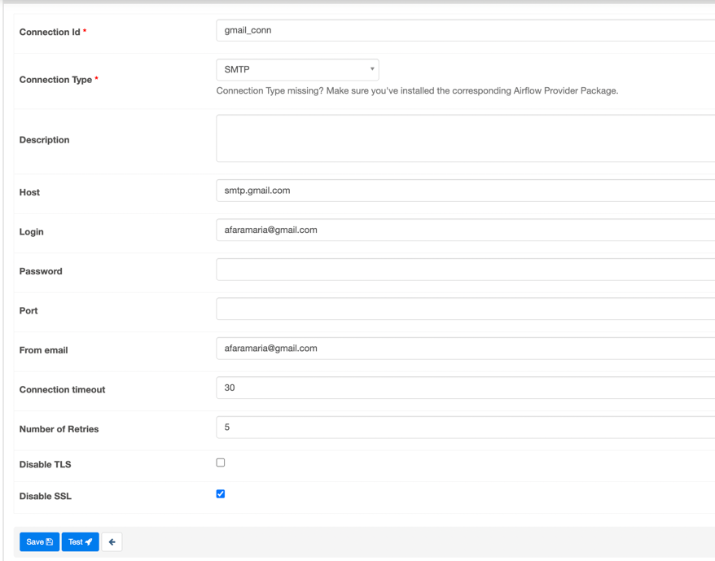
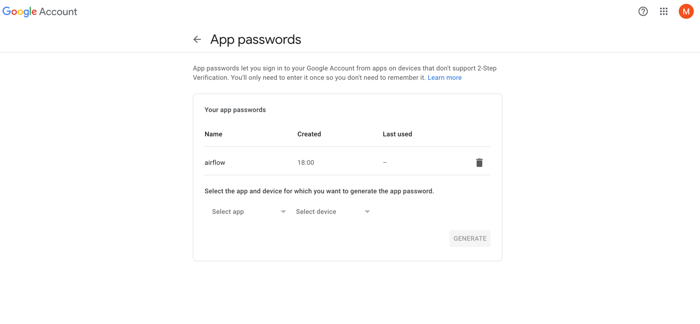
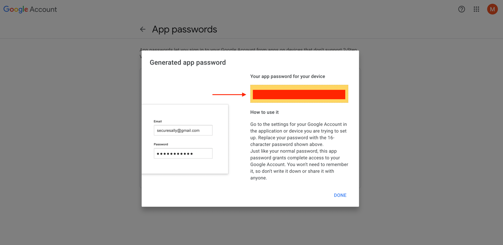

# TP2

The goal of this task is to create a DAG that generates data, validates it, and decides whether to continue with
downstream processing or send an email notification based on the validation result.
The purpose of this exercise is to practice using the EmailOperator and branching in Airflow.

## DAG Details

The DAG, named "dag1", is scheduled to start on April 23, 2023, with no schedule interval and catchup set to False.

### Tasks

The DAG consists of five tasks:

#### Task 1: generate_data

This task generates a list of numbers [1, 2, 3, 4, 5] and provides the context to other tasks.

#### Task 2: validate_data

This task validates the data generated by the generate_data task. In this example, a random boolean value is generated
to simulate data validation.

#### Task 3: branch

This is a branching task that decides whether to continue with downstream processing or send an email notification based
on the result of the data validation.

#### Task 4: send_email

This task sends an email notification if the data validation fails or downstream processing is skipped. The email is
sent using an SMTP connection, with the email address specified in the "to" parameter.

#### Task 5: downstream_processing

This task is executed if the data validation is successful and downstream processing is not skipped. In this example, it
prints the message "Data processing complete."

### Dependencies

The dependencies between tasks are defined as follows:

- generate_data task must be executed before the validate_data task.
- validate_data task must be executed before the branch task.
- branch task must be executed before the send_email or downstream_processing tasks, depending on the result of the data
  validation.

### Operators

The DAG uses the following operators:

- BranchPythonOperator: used to decide whether to continue with downstream processing or send an email notification
  based on the result of the data validation.
- EmailOperator: used to send email notifications if the data validation fails or downstream processing is skipped.

## SMTP Connection

An SMTP connection is required to send email notifications using the EmailOperator. It is recommended to create an SMTP
connection in Airflow's UI to securely store the connection parameters and reuse them across multiple DAGs.

To create an SMTP connection in the UI, navigate to the "Admin" tab and select "Connections". From there, click on the "
Create" button and provide a connection ID, the host name of your email server, the port number, and any other required
authentication parameters such as a username and password.

Once you have created the SMTP connection, reference it in your DAGs by providing its connection ID to the
EmailOperator. This ensures that your email notifications are sent securely and using the correct connection parameters.

### SMTP Provider

To use the EmailOperator, the SMTP provider must be installed. Use apache-airflow-providers-smtp==1.0.1 to install the
provider.

### How to create the password:

To create an app password for your SMTP connection, you need to have 2-step authentication enabled and an [authenticator
app](https://myaccount.google.com/two-step-verification/authenticator) created to get verification codes from it.

Then, you can generate a new app password for your SMTP connection by doing the following steps:

- [Go to Google account -> security -> app passwords](https://myaccount.google.com/apppasswords)
- Select Mail app and choose other (Custom name) as the device and name it airflow for example.
- Once you click generate, an app password is created and you must immediately copy it and add it to your SMTP
  connection password field as it will disappear afterwards.

## Future Improvements

While this DAG is a simple example of branching and data validation, it can be extended to include more complex logic to
validate data and handle branching based on multiple conditions. Additionally, the email notification task can be
improved to use dynamic email addresses and messages based on the validation result.