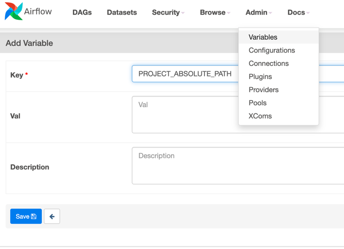

# TP3

This exercise is aimed at teaching how to use
the [DockerOperator](https://airflow.apache.org/docs/apache-airflow-providers-docker/stable/_api/airflow/providers/docker/operators/docker/index.html
) in Apache Airflow to run tasks in Docker containers.

The DAG created includes two tasks: one that runs a script called create_df that creates a pandas DataFrame and stores
it in a Docker container, and another that runs a script called print_df that reads the CSV file created by the first
task and prints its contents.

To get started, the following steps were taken:

1. A Dockerfile and a requirements.txt file were created to define the image used in the DockerOperator. The Dockerfile
   installs pandas and sets up the working directory, while the requirements.txt file lists the dependencies.
   You can build the image with the following command:
   ```bash
   docker build -t my_pandas_image .
   ```
2. The DAG was defined in a file called dag.py. It includes two DockerOperator tasks: one for create_df and one for
   print_df.

3. The create_df task was defined with the following parameters for the DocerOperator:
    - task_id: The name of the task.
    - image: The name of the Docker image to use for the task.
    - api_version: The version of the Docker API to use.
    - auto_remove: Whether to automatically remove the container after it completes.
    - command: The command to run inside the container.
    - docker_url: The URL of the Docker daemon to connect to.
    - network_mode: The network mode to use for the container.

4. The print_df task was defined with similar parameters, but with a different command that reads the CSV file created
   by the create_df task.

5. The task dependencies were set up so that print_df depends on create_df.

6. The [apache-airflow-providers-docker](https://airflow.apache.org/docs/apache-airflow-providers-docker/stable/index.html)
package was added to the requirements.txt file to enable the DockerOperator.

7. The [docker-socket-proxy service](https://github.com/Tecnativa/docker-socket-proxy) was added to the Docker Compose
   file to allow the DockerOperator to communicate with
   the Docker daemon.

---------
Additional changes:

- Store DATAFRAME CSV into a mounted folder 'data'
- Use Mount type to mount the data folder to the containers used with DockerOperator.
- To be able to mount a specific directory on your machine, you have to use an absolute path that is specific to your
  local machine, so you can define it as an airflow variable and access it within your Airflow DAG.
- You can set the value of PROJECT_ABSOLUTE_PATH as an Airflow Variable through the Airflow UI or using the airflow
  variables CLI command.
  PROJECT_ABSOLUTE_PATH as key; /path/to/your/directory as value

