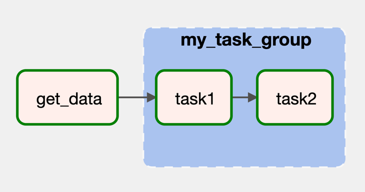
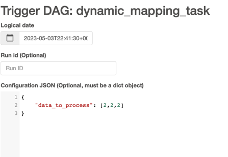
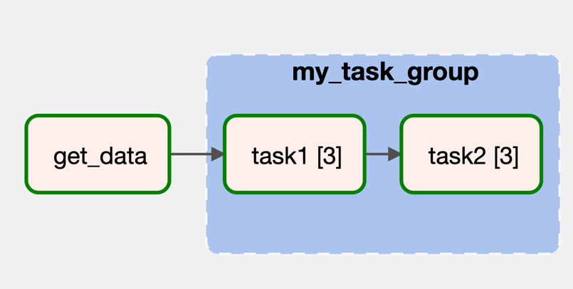
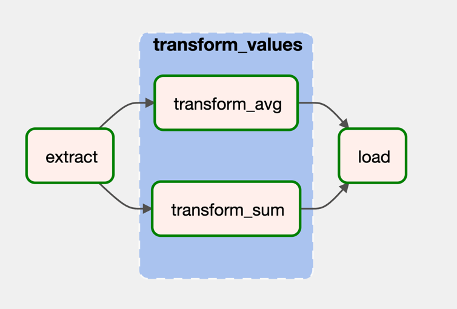
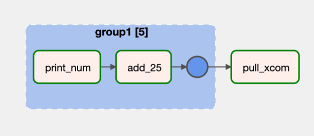

# TP4

The purpose of this exercise is to demonstrate the use of Airflow **task groups** and **decorators** in creating DAGs.
It also shows how tasks can take inputs from other tasks and how sub-tasks can be used within task groups.

## decorators_dag

This Dag uses the `@dag` decorator. The DAG runs once
every minute using the `schedule` parameter and starts from yesterday using the `start_date` parameter. The `catchup`
parameter is set to False, which means that Airflow won't try to execute any missed DAG runs.

The DAG contains two tasks: `get_data` and `my_task_group`. `get_data` is a Python function that generates a list of
integers from 0 to 9 and returns it. This function is decorated with the `@task` decorator, which makes it an Airflow
task.

The `my_task_group` task is a **task group** that takes in the output of `get_data` as input. It contains two
sub-tasks: `task1` and `task2`. Both sub-tasks are Python functions decorated with the `@task` decorator, which makes
them Airflow tasks. `task1` takes the first element of the input list and prints it to the console, then returns
it. `task2` simply returns the entire input list.

The `my_task_group` function returns the output of `task2`, which is the entire input list. This output is then passed
to `my_task_group` as input.

Finally, the `my_dag` function calls the `my_dag` DAG to create an instance of the DAG.

---

## decorators_dag_with_expand

This DAG demonstrates the use of dynamic mapping and parameterization in Airflow DAGs. It also shows how tasks can take
inputs from other tasks and how sub-tasks can be used within task groups.

When the DAG is executed, it retrieves a list of data to process from the `params` dictionary of the DAG run's context
using the `get_data` task. This input data is then passed as input to the `my_task_group` task group, which consists of
two sub-tasks: `task1` and `task2`. `task1` multiplies each item in the input data by 2, while `task2` adds 2 to each
item.

The `my_task_group` function uses the `expand` method of the `@task` decorator to create multiple instances of `task1`
for each item in the input data list. The output of `task1` (a list of doubled data) is then passed as input to `task2`,
which returns a list of data with 2 added to each item.

The final output of `my_task_group` (the list of data with 2 added to each item) is then returned as the final output of
the DAG.

Important details to note include the use of the `@task` and `@task_group` decorators to define tasks and task groups,
the use of dynamic mapping to create multiple instances of `task1`, and the use of parameterization to pass data to the
DAG at runtime. The scheduling and starting time of the DAG can also be customized using the `schedule` and `start_date`
parameters of the `@dag` decorator.

---

## multi_task_group_dag

This DAG showcases the usage of task groups in Airflow and demonstrates how tasks can be repeated within a loop to
create a series of similar tasks. It also highlights the process of setting task dependencies within a task group.

When the DAG is executed, it starts by creating the first task called 'task1' using the `DummyOperator` class. This task
serves as a placeholder or starting point for the DAG.

Next, a task group is defined using the `@task_group` decorator, and it is assigned the group ID 'task_group'. Within
the task group, a loop runs 'n' times (in this case, 'n' is set to 3). During each iteration of the loop, two tasks are
created: 'task2' and 'task3'. Both tasks are instances of the 'DummyOperator' class, and their task IDs are dynamically
generated by appending the value of 'i' to the task ID string ('task2_0', 'task2_1', etc.).

To establish the dependencies between the tasks within the task group, the `>>` operator is used. This notation
specifies that 'task1' must be completed before 'task2', and 'task2' must be completed before 'task3'. The tasks within
the task group are then added to the 'tasks' list.

Once the loop finishes, the task group function returns the 'tasks' list. Finally, the task group function '
create_task_group()' is called, which triggers the execution of the task group and its associated tasks.

To summarize the main takeaways from this DAG:

- Task groups offer a convenient way to organize and group related tasks together within a DAG.
- Tasks within a task group can be dynamically generated using loops, allowing for the creation of multiple tasks with
  different IDs or parameters.
- Task dependencies within a task group can be defined using the `>>` operator to specify their execution order.
- The DAG's start date, catch-up behavior, and scheduling interval can be customized using the corresponding parameters
  in the `@dag` decorator.

---- 

## task_group_example1.py

This DAG demonstrates the following concepts:

- How to define tasks and task groups in Airflow.
- How to pass data between tasks within a task group.
- How to perform data extraction, transformation, and loading operations using Airflow tasks.

The purpose of this DAG is to extract data, transform the extracted data by calculating the total value and average
value, and then load the transformed values.

### Operators and Functionalities

The DAG includes the following operators and functionalities:

extract_data: This operator is a Python function decorated as an Airflow task. It extracts data from a string in JSON
format and returns it as a Python dictionary.

transform_values: This operator is a task group, which allows grouping multiple tasks together. It takes the data_dict
extracted from the previous task and performs two transformations on it: transform_sum and transform_avg.

- transform_sum: This operator calculates the total value by summing all the values in the data_dict dictionary.

- transform_avg: This operator calculates the average value by summing all the values in the data_dict dictionary and
  dividing it by the number of elements in the dictionary.

- load: This operator is a Python function decorated as an Airflow task. It takes the transformed values as input and
  prints the total value and average value.

### `task` `decorator` parameters mentioned:

- `task_id`: This parameter specifies the unique identifier for the task. In the code, the task_id is set as a string
  value,
  such as "extract". The task_id is used to refer to the task and define dependencies between tasks.

- `retries`: This parameter defines the number of times the task should be retried in case of failures. In the code, the
  retries parameter is set to 2, which means that if the task fails, Airflow will automatically retry it two more times
  before considering it as a failure.

The names of the tasks are the names of the functions decorated with the task decorator.

### Execution Flow

The execution flow of the DAG is as follows:

The extract_data task is executed first, which extracts the data from a JSON string and returns a dictionary.

The transform_values task group is executed, taking the extracted data dictionary as input.

- The transform_sum task is executed within the task group, which calculates the total value.

- The transform_avg task is executed within the task group, which calculates the average value.

The transformed values are passed as input to the load task, which prints the total value and average value.

---- 

## task_group_mapping_example

The purpose of this DAG is to showcase the usage of task groups and task mapping in Airflow.

This DAG showcases the following concepts:

How to define task groups using the task_group decorator.
How to use task mapping to execute tasks with different inputs in parallel.
How to retrieve and utilize XCom values from specific tasks using the xcom_pull method.

### Operators and Functionalities

The DAG includes the following operators and functionalities:

task_group1: This operator is a task group created using the task_group decorator. It defines a group of tasks that
share the same group ID.

- `print_num`: This operator is a Python function decorated as an Airflow task. It takes a number as input and returns
  the same number.

- `add_25`: This operator is a Python function decorated as an Airflow task. It takes a number as input, adds 25 to it,
  and returns the result.

- `pull_xcom`: This operator is a Python function decorated as an Airflow task. It pulls the XCom values from a specific
  task in the task group and prints them out. It utilizes the xcom_pull method to retrieve `XComs`.

### Execution Flow

The execution flow of the DAG is as follows:

The task_group1 task group is executed. Within this task group, the print_num task is executed, followed by the add_25
task. The my_num parameter is dynamically provided to the task group.

The pull_xcom task is executed. It pulls the XCom values from the add_25 task within the task_group1 task group. It
retrieves the XCom values from specific mapped task group instances using the map_indexes parameter.

The map_indexes parameter is used in the code to specify the specific mapped task group instances from which to pull
XCom values. It allows you to retrieve XCom values from specific instances of a task within a task group.

### Task Mapping and Dependencies

The code demonstrates the concept of task mapping, which allows for executing tasks with different inputs in parallel.
In this case, six mapped task group instances of task_group1 are created with different my_num
inputs: [5, 25, 35, 0, 10].

The dependencies within the DAG are defined as follows:

The task_group1_object (mapped instances of task_group1) is set as a dependency for the pull_xcom task using the >>
operator.

---- 
