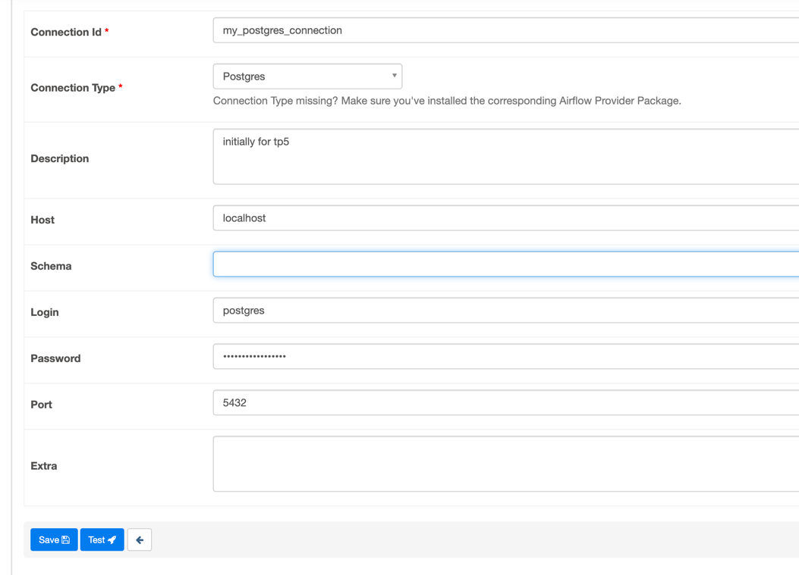

# TP5

Use a new operator:
running a query on a Postgres database. These operators have one and only one specific use case, such as running a
query. As a result, they are easy to use by simply providing the query to the operator, and the operator internally
handles the querying logic


in one of the dags use PostgresstoS3Operator .....
----

integrate postgress database

----
In postgres-db directory there's a Dockerfile that you can use to create a PostgreSQL database container

In this Dockerfile, we specify the base image as postgres, set the POSTGRES_PASSWORD environment variable to the desired
password, and copy an initialization script (init.sql) to the container's /docker-entrypoint-initdb.d/ directory. The
initialization script can contain SQL commands to create tables or perform other database setup tasks.

To build an image from this Dockerfile, then run the following command
from the postgres-db directory:

```bash
cd postgres-db
docker build -t tp5-postgres-image .
```

This command will build the Docker image using the Dockerfile and tag it as tp5-postgres-image.

Once the image is built, you can run a container from it using this command:

```bash
docker run --name tp5-postgres -p 5432:5432 -d tp5-postgres-image
```

To stop and remove the postgres container, run:

```bash
docker stop tp5-postgres
docker rm tp5-postgres
```

With this Dockerfile, we have customized and built our own PostgreSQL database image for our specific needs.

To Connect to the Database:

Use the following connection details:
Host: localhost (or the IP address of your Docker host machine)
Port: 5432
Database Name: postgres (or the default database name for the specific image you're using)
Username: postgres
Password: postgres_password (or the password you set during container creation)

---
fill_db.py
This script will generate 100 unique samples of fake names and email addresses using the Faker library and will fill
the "users" table with them.

Once you have the init.sql file for table creation and you run the fill_dv.py script for data insertion, you can run
the Airflow DAG.

```bash
pip install -r postgres-db/requirement.txt
```

```bash
python postgres-db/fill_db.py
```

to check whether the tables and data were inserted correctly?

In your Airflow connections, create a new connection called "my_postgres_connection" with the necessary credentials and
connection details for your PostgreSQL container.





http://localhost:5050/ 

      PGADMIN_DEFAULT_EMAIL: admin@pgadmin.com
      PGADMIN_DEFAULT_PASSWORD: admin_password